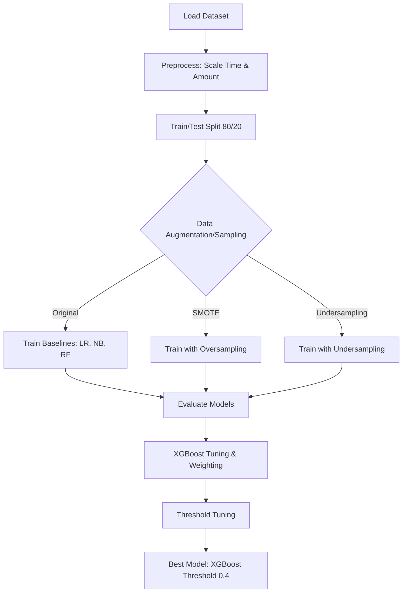

# Credit Card Fraud Detection

## Project Overview
This project implements a machine learning system to detect fraudulent credit card transactions. The dataset (`creditcard.csv`) used is highly imbalanced, with frauds accounting for only ~0.172% of all transactions. The primary objective is to minimize false negatives (maximizing recall) while keeping false positives low (maintaining precision), ensuring that genuine customers are not inconvenienced while actively catching fraudulent activity.

## System Flow Diagram

## Technologies Used
*   **Python:** Primary programming language.
*   **Pandas & NumPy:** Data manipulation and numerical operations.
*   **Scikit-Learn:** Machine learning models (Logistic Regression, Naive Bayes, Random Forest), preprocessing (StandardScaler), and evaluation metrics.
*   **Imbalanced-Learn (imblearn):** Handling class imbalance using SMOTE and Random Undersampling.
*   **XGBoost:** High-performance gradient boosting classifier used for the final model.
*   **Matplotlib & Seaborn:** Data visualization and plotting evaluation curves (AUPRC, ROC, etc.).

## Testing Flow & Methodology
To find the optimal model, a comprehensive testing flow was utilized:
1.  **Baseline Evaluation:** We started by training Logistic Regression, Naive Bayes, and Random Forest classifiers on the raw imbalanced data.
2.  **Data Augmentation (SMOTE):** We applied the Synthetic Minority Over-sampling Technique (SMOTE) to synthetically balance the training data, observing improvements in recall but drops in precision for some models.
3.  **Undersampling:** We experimented with undersampling the majority class, which resulted in high recall but unacceptably low precision.
4.  **Advanced Strategies:** We tested threshold tuning, cost-sensitive learning, and hybrid sampling (SMOTE+ENN) to balance the precision-recall tradeoff.

## The Best Model: XGBoost
Our best-performing model was **XGBoost**. Because tree-based ensemble models naturally handle imbalanced data better, we bypassed SMOTE and trained XGBoost on the original data.
*   **Class Weighting:** We used the `scale_pos_weight` parameter to penalize mistakes on the minority fraud class heavily.
*   **Hyperparameter Tuning:** We used `RandomizedSearchCV` to fine-tune the model's parameters (max depth, learning rate, estimators, etc.).
*   **Threshold Tuning:** By lowering the prediction threshold to 0.4, we achieved our optimal result: **86% Recall and 0.896 AUPRC** with negligible False Positives. This provided the best balance, minimizing both missed frauds and false alarms.

## Simplified Model (Feature Importance)
In real-world production environments, inference speed is critical. We extracted the feature importances from our tuned XGBoost model and trained simplified versions using only the Top 5 and Top 10 features.
*   The **Top 10 Features Model** performed remarkably well, retaining 84% Recall and 76% Precision.
*   This approach demonstrates how to reduce computational overhead and create simple fallback rules while still catching a vast majority of fraud.

## How to Use in Google Colab
To run this notebook yourself:
1.  Download this repository.
2.  Open [Google Colab](https://colab.research.google.com/) and upload the `Credit_Card_Fraud.ipynb` notebook.
3.  Upload the `creditcard.csv` dataset (located in the `data/` directory of this repository) to the root `/content/` directory of your Colab environment.
4.  Run the cells sequentially to see the data processing, model training, and evaluation metrics.
